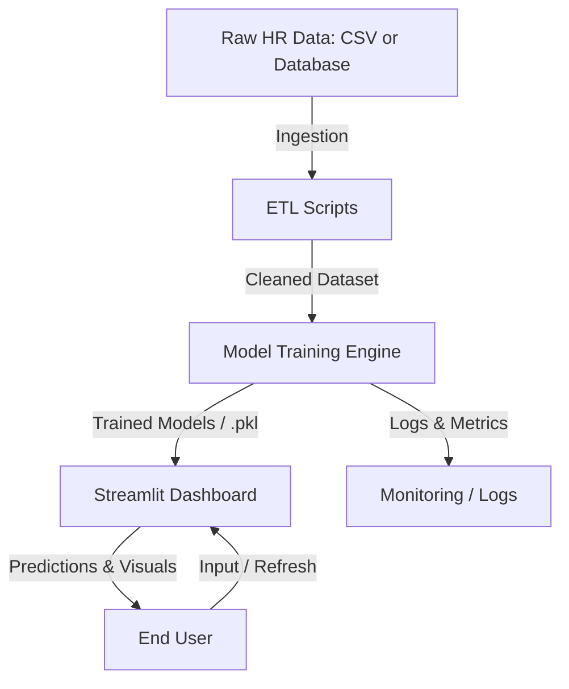

# 🧩 HR-Employee-Insights-Dashboard — V.0 Prototype Build

> **HR Insight System — Intelligent HR Analytics Platform (Streamlit + Scikit-learn Prototype)**
> The foundation of a data-driven HR analytics ecosystem.


---

## 🧠 Overview

**HR-Employee-Insights-Dashboard (V.0)** marks the **first prototype phase** of the intelligent HR analytics system.
It transforms static HR datasets into **interactive dashboards and predictive insights**, demonstrating end-to-end functionality — from **data ingestion** to **machine learning predictions** and **visual reporting**.

This prototype focuses on **Streamlit**, **Scikit-learn**, and **Python ETL scripting**, proving the system’s feasibility and establishing the foundation for future full-stack builds with **FastAPI + GCP**.

---

## 🎯 Objective

To design a **smart HR data engine** capable of:

* Centralizing HR data (employee details, performance, satisfaction, attrition)
* Generating predictive analytics using ML models
* Providing dynamic visualization dashboards for HR strategy
* Building a modular system ready for cloud integration (GCP)

---

## ⚙️ Tech Stack

| Layer                    | Technology          | Description                                       |
| :----------------------- | :------------------ | :------------------------------------------------ |
| **Frontend**             | Streamlit           | Interactive and lightweight HR analytics UI       |
| **Backend (Local)**      | Python              | Handles ETL, preprocessing, and model logic       |
| **Database (Prototype)** | SQLite / CSV        | Stores processed and cleaned HR data              |
| **Machine Learning**     | Scikit-learn        | Predictive modeling for attrition and performance |
| **Visualization**        | Matplotlib, Seaborn | Charting and KPI visualizations                   |
| **Logging**              | Python Logging      | Captures ingestion and processing flow            |

---

## 🧩 Core Features

* 🧮 **Data Cleaning & ETL** — Automated data preprocessing and transformation
* 📈 **Interactive Dashboards** — Real-time metrics for HR analytics
* 🤖 **Predictive Modeling** — ML models for attrition and performance trends
* 🧠 **Insight Generator** — Provides explainable predictions and key metrics
* 🧾 **Logging & Traceability** — Maintains full log trail for debugging and audit

---

## 🧪 Prototype Workflow



---

## 📁 File Structure (V.0)

```
│   app.py
│   requirements.txt
│
├───config
│       db_config.json
│
├───data
│       raw_hr_data.csv
│       cleaned_hr_data.csv
│
├───logs
│       data_cleaning.log
│       model_training.log
│       dashboard.log
│
├───models
│       attrition_model.pkl
│       performance_model.pkl
│
├───scripts
│   ├───ingestion
│   │       data_ingestion.py
│   ├───preprocessing
│   │       data_cleaning.py
│   └───model
│           model_training.py
│           model_prediction.py
│
└───pipeline
        run_pipeline.py
```

---

## 🧱 Key Modules

| Module                    | Description                                              |
| :------------------------ | :------------------------------------------------------- |
| **`data_ingestion.py`**   | Reads HR dataset (CSV/API) and initializes database load |
| **`data_cleaning.py`**    | Handles nulls, outliers, and encodes categorical data    |
| **`model_training.py`**   | Trains models for attrition and performance prediction   |
| **`model_prediction.py`** | Loads models and generates dashboard predictions         |
| **`run_pipeline.py`**     | Orchestrates complete ETL → ML → dashboard flow          |
| **`app.py`**              | Streamlit UI combining visuals and prediction modules    |

---

## 💬 Example Dashboard Snapshot

<p align="center">
  
</p>

---

## 📘 Example Code Snippet — `app.py`

```python
import streamlit as st
import pandas as pd
import pickle

# Load trained model
model = pickle.load(open("models/attrition_model.pkl", "rb"))
data = pd.read_csv("data/cleaned_hr_data.csv")

st.title("HR Insight System — Employee Attrition Prediction")

# Sidebar input
st.sidebar.header("Input Parameters")
age = st.sidebar.slider("Age", 18, 60, 30)
job_satisfaction = st.sidebar.slider("Job Satisfaction", 1, 5, 3)
years_at_company = st.sidebar.slider("Years at Company", 0, 20, 5)

# Convert to DataFrame
input_data = pd.DataFrame({
    "Age": [age],
    "JobSatisfaction": [job_satisfaction],
    "YearsAtCompany": [years_at_company]
})

# Prediction
prediction = model.predict(input_data)
result = "Yes (Attrition Risk)" if prediction[0] == 1 else "No (Stable Employee)"

# Display
st.subheader("Prediction Result:")
st.write(f"Employee Attrition Risk: **{result}**")

# Display data preview
st.write("### Employee Data Snapshot")
st.dataframe(data.head())
```

---

## 🧠 Internal Logic

1. **Data Ingestion:** Pulls and logs raw HR data
2. **Cleaning Process:** Prepares structured data for modeling
3. **Model Training:** Builds and saves ML models as `.pkl`
4. **Dashboard Visualization:** Streamlit visualizes predictions and HR metrics
5. **Logging:** Every step tracked under `/logs`

---

## 🚀 Prototype Achievements

✅ Interactive and responsive Streamlit dashboard
✅ Functional ML pipeline with `.pkl` model integration
✅ Automated ETL process with logged workflows
✅ Modular, scalable folder structure ready for expansion

---

## ⚙️ Environment Setup

1. **Clone Repository**

```bash
git clone https://github.com/GKTHIRUMARAN/HR-Employee-Insights-Dashboard.git
cd HR-Employee-Insights-Dashboard/V.0
```

2. **Python Virtual Environment**

```bash
python -m venv venv
venv\Scripts\activate
```

3. **Install Dependencies**

```bash
pip install -r requirements.txt
```

4. **Environment Variables (`.env`)**

Create `.env` in root (example):

```env
DB_PATH=data/cleaned_hr_data.csv
LOG_LEVEL=INFO
MODEL_PATH=models/attrition_model.pkl
```

5. **Run Application**

```bash
streamlit run app.py
```

---

## ✅ Current Capabilities

| Feature                         | Status        |
| :------------------------------ | :------------ |
| HR Data Ingestion               | ✅ Implemented |
| Data Cleaning & Preprocessing   | ✅ Implemented |
| Predictive Attrition Modeling   | ✅ Implemented |
| Predictive Performance Modeling | ✅ Implemented |
| Interactive Streamlit Dashboard | ✅ Implemented |
| Logging & Traceability          | ✅ Implemented |
| Modular ETL → ML Pipeline       | ✅ Implemented |

---

## 🧩 Future Goals (Toward V.1)

| Upgrade            | Description                                                    |
| :----------------- | :------------------------------------------------------------- |
| **Backend**        | Move from local to FastAPI backend for API-driven predictions. |
| **Frontend**       | Upgrade Streamlit → React for dynamic dashboards.              |
| **Database**       | Migrate SQLite → PostgreSQL / BigQuery.                        |
| **Deployment**     | Integrate with GCP Cloud Run for scalability.                  |
| **Explainability** | Add SHAP/LIME for transparent model decisions.                 |

---

## 🔗 Project Links

| Resource               | Link                                                                                             |
| :--------------------- | :----------------------------------------------------------------------------------------------- |
| 🏠 **Main Repository** | [HR-Employee-Insights-Dashboard](https://github.com/GKTHIRUMARAN/HR-Employee-Insights-Dashboard) |
| 📂 **V.0 Folder**      | [Prototype Build](https://github.com/GKTHIRUMARAN/HR-Employee-Insights-Dashboard/tree/main/V.0)  |
| ⚙️ **License**         | [MIT License](https://github.com/GKTHIRUMARAN/HR-Employee-Insights-Dashboard/blob/main/LICENSE)  |

---

## 🧩 How It Fits in the Whole Project

**V.0** serves as the **foundation layer** of the *HR Insight System*, validating the data flow, modeling accuracy, and user interface design.
It lays the groundwork for **V.1**, which expands into API-backed cloud scalability and advanced analytics integration.

> 🪴 Think of this version as the seed — all future builds grow from this structure.

[⬅ Back to Main README](../README.md)

---

## 👤 Author
**GK Thirumaran**  
🎓 *B.Tech Artificial Intelligence and Data Science*  
🌍 *Coimbatore, Tamil Nadu, India*  
💼 *Aspiring Data Scientist & Analyst | AIML Developer*  
🔗 [Linkedin](https://www.linkedin.com/in/thirumarangk-ai) | [Porfolio](https://maranthiru180.wixsite.com/my-site)
